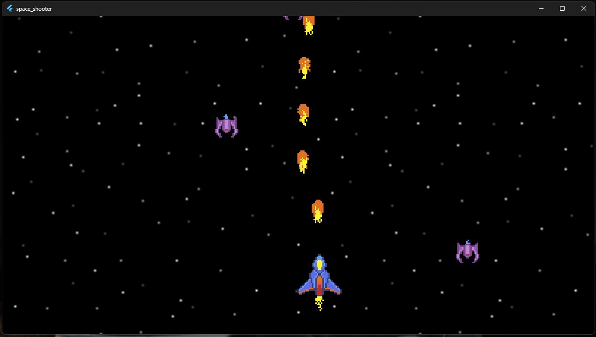
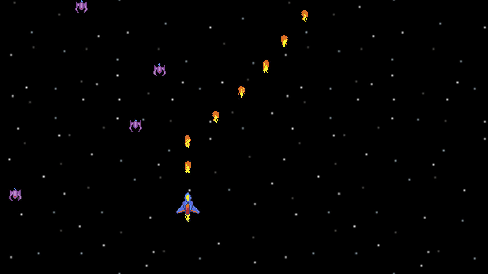
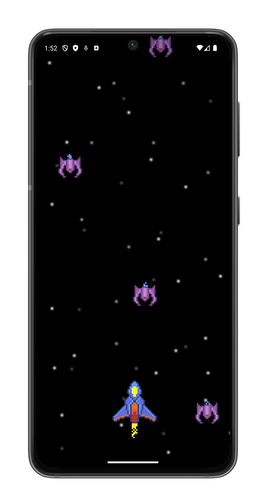
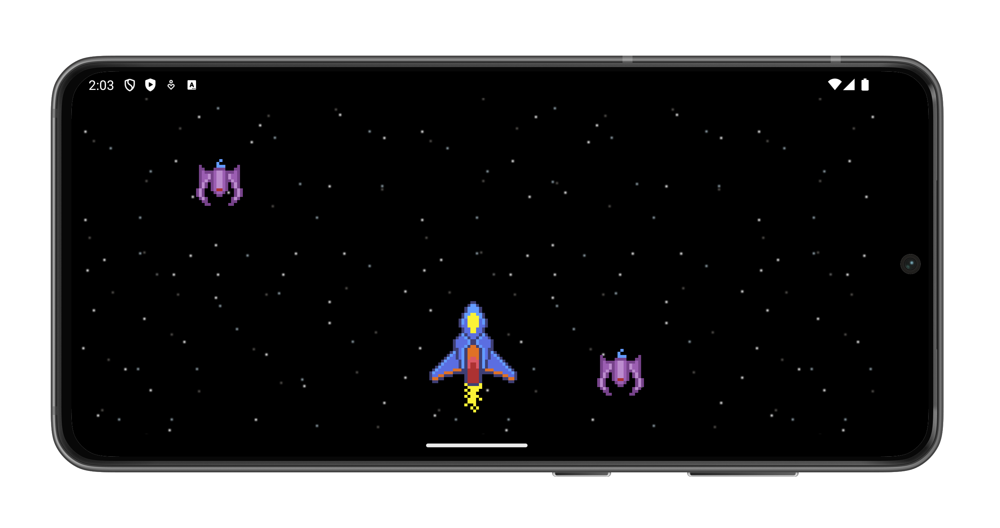

# 🚀 Space Shooter Game

A fast-paced 2D space shooter game built with Flutter and [Flame](https://flame-engine.org), playable on Web, Android, and Windows.  
Pilot your spaceship through the galaxy, dodge enemy fire, and shoot down alien-like invaders in this action-packed arcade experience.

---

## 🕹️ Features

- 🌌 Space-themed background and sound effects
- 👾 Alien spaceship enemies with increasing difficulty
- 🔫 Smooth shooting mechanics and collision detection
- 🧠 Simple AI movement for enemies
- 🎮 Keyboard or on-screen controls (platform-dependent)
- 📱 Runs on web, desktop, or mobile

---

## 🧰 Tech Stack

- **Game Engine:** [Flame](https://flame-engine.org)
- **Framework:** Flutter
- **Platform Support:** Web, Android, Windows
- **Language:** Dart

---

## 🛠 Development Environment

- **Flutter SDK:** `v3.29.0`
- **Dart SDK:** `v3.7.0`

---

## 📷 Screenshots

> Screenshots from each platform

### 🖥️ Windows



---

### 🌐 Web


---

### 📱 Android

| Portrait                                                       | Landscape                                                        |
|----------------------------------------------------------------|------------------------------------------------------------------|
|  |  |
---

## 🌐 Live Demo

- 🔗 **Web (GitHub Pages):**  
  [Play Now](https://omnitechphilippines.github.io/space-shooter/)

---

## 📦 Download Releases

- 💻 **Windows (.7z):**  
  [Download for Windows {{VERSION}}](https://github.com/omnitechphilippines/space-shooter/releases/download/{{ENCODED_VERSION}}/windows-release-{{ENCODED_VERSION}}.7z)

- 📱 **Android (.apk):**  
  [Download for Android {{VERSION}}](https://github.com/omnitechphilippines/space-shooter/releases/download/{{ENCODED_VERSION}}/app-release-{{ENCODED_VERSION}}.apk)

- 🌐 **Web build (.7z):**  
  [Download Web Build {{VERSION}}](https://github.com/omnitechphilippines/space-shooter/releases/download/{{ENCODED_VERSION}}/web-release-{{ENCODED_VERSION}}.7z)

> You can also find all versions in the [Releases Page](https://github.com/omnitechphilippines/space-shooter/releases)

---

## 🏁 Getting Started (Development)

### Prerequisites

- Flutter SDK `v3.29.0`
- Dart SDK `v3.7.0`

### Installation

```bash
# Clone the repo
git clone https://github.com/omnitechphilippines/space-shooter.git
cd space-shooter

# Get packages
flutter pub get
